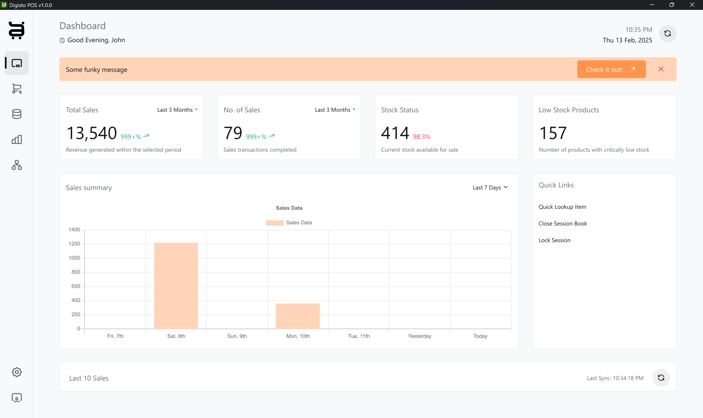
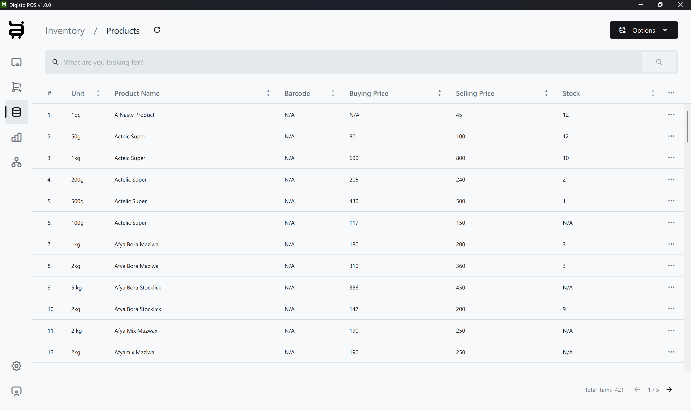

# Digisto - Efficient POS & Inventory Management

**Powerful. Intuitive. Reliable.**

Digisto is a professional POS (Point of Sale) and inventory management software designed for businesses to efficiently manage sales, stock, and operations. Built with **Qt/C++** and powered by **PocketBase**, Digisto ensures a smooth and responsive experience for business owners and cashiers.

## Features

- **POS System**: Sell products in-store with an intuitive cashier interface.
- **Inventory Management**: Add, view, and manage products and stock supplies.
- **Business Administration**: Configure business details, user accounts, and permissions.
- **Dashboard Insights**: Quick view of sales trends, stock levels, and business performance.
- **User-Friendly Interface**: Designed for ease of use with a professional and clean UI.

## Technology Stack

- **Frontend & Core**: Qt 6.7.x (C++)
- **Backend/API**: PocketBase (Extended with JavaScript)

## Status

🔧 **Currently in Alpha** – Some features may not be fully implemented yet.

## Getting Started

Coming soon! The official website will be available at [https://digisto.app](https://digisto.app).

Stay tuned for installation guides, setup instructions, and release updates.

---

For questions, feedback, or contributions, feel free to reach out or open an issue on GitHub.

---

© 2025 Digisto. All rights reserved.
